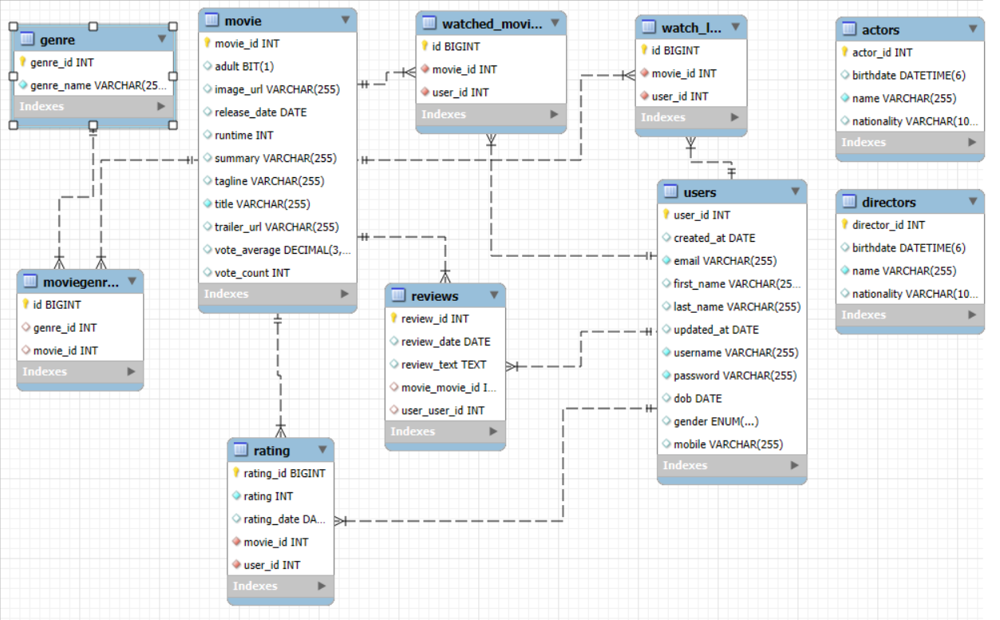
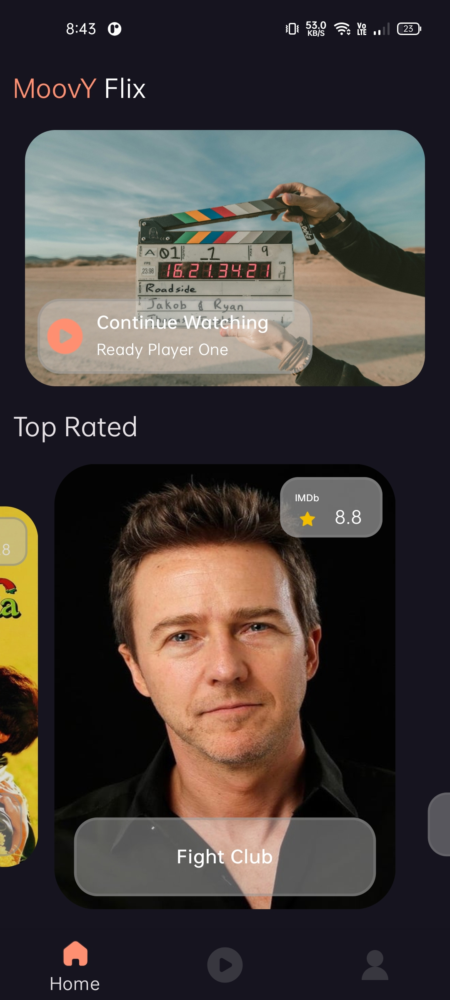
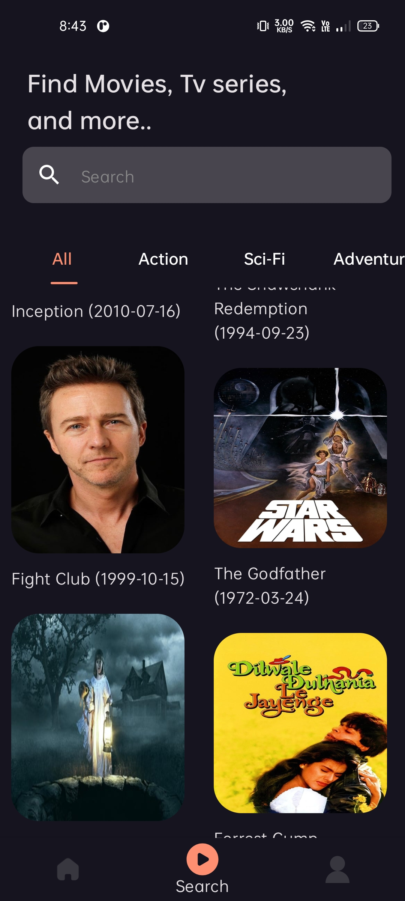
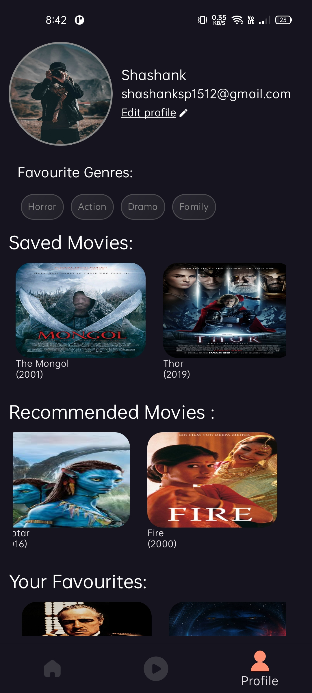
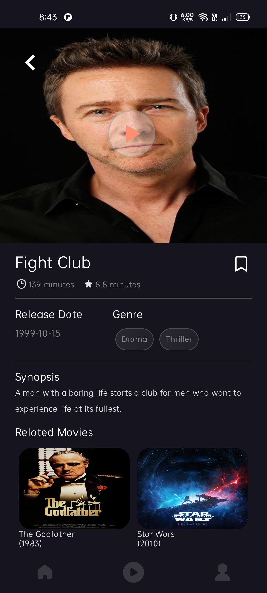
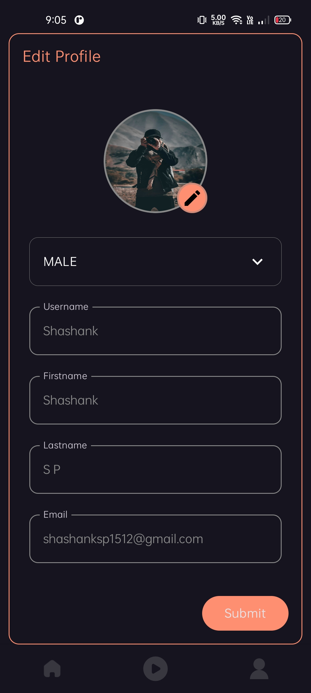

# Moovy
## Still working on it... 😊
Moovy is a movie application similar to IMDb. It allows users to browse, search, and filter movies, as well as manage personal watchlists, mark movies as watched, rate them, and write reviews. Users can also apply advanced filters to discover movies by genre, director, and release period.

## Features

- View and search for movies.
- Filter movies by genre and other criteria.
- Add movies to a watchlist and mark them as watched.
- Rate and review movies (requires user login).

## Technologies Used

- **Frontend**: Android [[code repo]](https://github.com/Shashankappu/MovieTime)
- **Backend**: Java 21 with Spring Boot 3
- **Database**: MySQL

## Project Members

- **[Punith Kumar P R](https://github.com/punith-kumar-pr)**
- **[Shashank S P](https://github.com/Shashankappu)**

## DB Schema

## Screenshots of Android App

## Thank You

