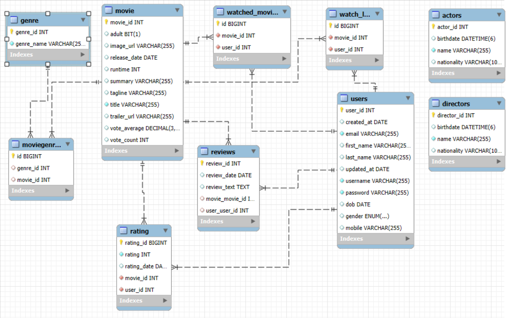

# Moovy - Movie Management Backend

A robust Spring Boot REST API for managing movies, user watchlists, ratings, and reviews with comprehensive authentication and role-based access control.

## 🎯 Overview

Moovy is a movie application similar to IMDb. It allows users to browse, search, and filter movies, as well as manage personal watchlists, mark movies as watched, rate them, and write reviews. Users can also apply advanced filters to discover movies by genre and other criteria.

## ✨ Features

- **User Authentication**: JWT-based authentication with role-based access control
- **Movie Management**: Browse, search, and filter movies by genre
- **Watchlist Management**: Create and manage personal watchlists
- **Watched Movies**: Track movies you've already watched
- **Ratings & Reviews**: Rate and review movies
- **Admin Dashboard**: Manage users, assign roles, and control access
- **Secure API**: All endpoints protected with Spring Security

## 🛠 Technologies Used

- **Backend**: Java 21 with Spring Boot 3.3.2
- **Database**: MySQL 8.0+
- **Authentication**: JWT (JSON Web Tokens)
- **Security**: Spring Security 6
- **ORM**: Spring Data JPA with Hibernate
- **Build Tool**: Maven
- **Frontend**: Android (Kotlin & Jetpack Compose) [[code repo]](https://github.com/Shashankappu/MovieTime)

## 📋 Prerequisites

- Java 21 or higher
- MySQL 8.0 or higher
- Maven 3.6+
- Git

## 🚀 Setup Instructions

### 1. Clone the Repository

```bash
git clone https://github.com/punith-kumar-pr/Moovy-server.git
cd Moovy-server
```

### 2. Configure Database

Create a MySQL database:

```sql
CREATE DATABASE moovy;
```

Update `application.properties` with your database credentials:

```properties
spring.datasource.url=jdbc:mysql://localhost:3306/moovy
spring.datasource.username=root
spring.datasource.password=your_password
spring.jpa.hibernate.ddl-auto=update
```

### 3. Configure JWT Secret

Update `application.properties` with a strong JWT secret (minimum 32 characters):

```properties
app.jwtSecret=your-very-long-secret-key-change-this-in-production-at-least-32-chars
app.jwtExpirationInMs=86400000
```

### 4. Build and Run

```bash
mvn clean package
mvn spring-boot:run
```

The server will start at `http://localhost:8080`

## 🔐 Authentication & Authorization

### User Roles

The system supports three roles:

- **ROLE_USER**: Regular user (default role for all new registrations)
- **ROLE_ADMIN**: Full administrative access
- **ROLE_MODERATOR**: Moderation capabilities

### JWT Token Structure

After login/registration, you'll receive a JWT token:

```json
{
  "token": "eyJhbGciOiJIUzUxMiJ9...",
  "type": "Bearer",
  "userId": 1,
  "username": "john_doe",
  "email": "john@example.com",
  "roles": ["ROLE_USER"]
}
```

### Using JWT Token

Include the token in all authenticated requests:

```
Authorization: Bearer <your_jwt_token>
```

### Security Design

All user-specific endpoints derive the user identity from the JWT token — the server **never** trusts a client-supplied `userId`. This means:
- You cannot access or modify another user's data
- Watchlists, watched movies, profile changes are all scoped to the authenticated user
- Only admin endpoints accept `userId` as a path parameter

---

## 📚 API Documentation

### Base URL
```
http://localhost:8080/api/v1
```

### API Endpoint Summary

| Method | Endpoint | Auth | Description |
|--------|----------|------|-------------|
| `POST` | `/auth/register` | Public | Register new user |
| `POST` | `/auth/login` | Public | Login, get JWT token |
| `GET` | `/me/profile` | 🔒 Authenticated | Get own profile |
| `PUT` | `/me/profile` | 🔒 Authenticated | Update own profile |
| `PUT` | `/me/change-password` | 🔒 Authenticated | Change own password |
| `PUT` | `/me/change-contact` | 🔒 Authenticated | Change own email/mobile |
| `GET` | `/movies` | Public | List all movies |
| `GET` | `/movies/top-rated` | Public | Top rated movies |
| `GET` | `/movies/{title}` | Public | Search by title |
| `GET` | `/movies/by-genre` | Public | Filter by genre |
| `GET` | `/movies/by-genres` | Public | Filter by multiple genres |
| `GET` | `/movies/search` | Public | Search movies |
| `GET` | `/genres` | Public | List all genres |
| `POST` | `/watchlist` | 🔒 Authenticated | Add movie to watchlist |
| `GET` | `/watchlist` | 🔒 Authenticated | Get own watchlist |
| `DELETE` | `/watchlist/{movieId}` | 🔒 Authenticated | Remove from watchlist |
| `POST` | `/watched-movies` | 🔒 Authenticated | Mark movie as watched |
| `GET` | `/watched-movies` | 🔒 Authenticated | Get own watched movies |
| `DELETE` | `/watched-movies/{movieId}` | 🔒 Authenticated | Remove from watched |
| `GET` | `/admin/users` | 🔒 Admin | List all users |
| `PUT` | `/admin/users/{userId}/roles` | 🔒 Admin | Assign roles |
| `DELETE` | `/admin/users/{userId}` | 🔒 Admin | Deactivate user |

---

## 🔑 Authentication Endpoints

### 1. User Registration

**Endpoint**: `POST /auth/register`  
**Access**: Public  
**Description**: Register a new user account. Returns a JWT token on success.

**Request Body**:
```json
{
  "username": "john_doe",
  "email": "john@example.com",
  "password": "SecurePassword123",
  "firstName": "John",
  "lastName": "Doe"
}
```

**Response** (200 OK):
```json
{
  "token": "eyJhbGciOiJIUzUxMiJ9...",
  "type": "Bearer",
  "userId": 1,
  "username": "john_doe",
  "email": "john@example.com",
  "roles": ["ROLE_USER"]
}
```

**Error Responses**:
- `400` — Username already taken / Email already in use

**Example cURL**:
```bash
curl -X POST http://localhost:8080/api/v1/auth/register \
  -H "Content-Type: application/json" \
  -d '{
    "username": "john_doe",
    "email": "john@example.com",
    "password": "SecurePassword123",
    "firstName": "John",
    "lastName": "Doe"
  }'
```

---

### 2. User Login

**Endpoint**: `POST /auth/login`  
**Access**: Public  
**Description**: Login with existing credentials. Returns a JWT token on success.

**Request Body**:
```json
{
  "username": "john_doe",
  "password": "SecurePassword123"
}
```

**Response** (200 OK):
```json
{
  "token": "eyJhbGciOiJIUzUxMiJ9...",
  "type": "Bearer",
  "userId": 1,
  "username": "john_doe",
  "email": "john@example.com",
  "roles": ["ROLE_USER"]
}
```

**Error Responses**:
- `401` — Invalid username or password

**Example cURL**:
```bash
curl -X POST http://localhost:8080/api/v1/auth/login \
  -H "Content-Type: application/json" \
  -d '{
    "username": "john_doe",
    "password": "SecurePassword123"
  }'
```

---

## 👤 User Profile Endpoints (`/me`)

> All `/me` endpoints are scoped to the **authenticated user**. The user identity is extracted from the JWT token — no `userId` is required in the URL or request body.

### 3. Get My Profile

**Endpoint**: `GET /me/profile`  
**Access**: 🔒 Authenticated  
**Description**: Retrieve the authenticated user's profile

**Response** (200 OK):
```json
{
  "userId": 1,
  "username": "john_doe",
  "email": "john@example.com",
  "firstName": "John",
  "lastName": "Doe",
  "gender": "MALE",
  "mobile": "+919876543210",
  "dob": "1995-06-15",
  "createdAt": "2024-03-10",
  "roles": ["ROLE_USER"]
}
```

**Example cURL**:
```bash
curl -X GET http://localhost:8080/api/v1/me/profile \
  -H "Authorization: Bearer <your_token>"
```

---

### 4. Update My Profile

**Endpoint**: `PUT /me/profile`  
**Access**: 🔒 Authenticated  
**Description**: Update the authenticated user's profile (partial updates supported)

**Request Body** (all fields optional):
```json
{
  "firstName": "John",
  "lastName": "Doe",
  "gender": "MALE",
  "dob": "1995-06-15"
}
```

**Response** (200 OK):
```json
{
  "userId": 1,
  "username": "john_doe",
  "email": "john@example.com",
  "firstName": "John",
  "lastName": "Doe",
  "gender": "MALE",
  "mobile": "+919876543210",
  "dob": "1995-06-15",
  "createdAt": "2024-03-10",
  "roles": ["ROLE_USER"]
}
```

**Error Responses**:
- `400` — Invalid gender value (allowed: MALE, FEMALE)

**Example cURL**:
```bash
curl -X PUT http://localhost:8080/api/v1/me/profile \
  -H "Authorization: Bearer <your_token>" \
  -H "Content-Type: application/json" \
  -d '{
    "firstName": "Updated",
    "lastName": "Name",
    "gender": "MALE"
  }'
```

---

### 5. Change My Password

**Endpoint**: `PUT /me/change-password`  
**Access**: 🔒 Authenticated  
**Description**: Change the authenticated user's password. Requires current password for verification.

**Request Body**:
```json
{
  "currentPassword": "OldPassword123",
  "newPassword": "NewPassword456"
}
```

**Response** (200 OK):
```json
"Password changed successfully"
```

**Error Responses**:
- `400` — Current password is incorrect

**Example cURL**:
```bash
curl -X PUT http://localhost:8080/api/v1/me/change-password \
  -H "Authorization: Bearer <your_token>" \
  -H "Content-Type: application/json" \
  -d '{
    "currentPassword": "OldPassword123",
    "newPassword": "NewPassword456"
  }'
```

---

### 6. Change My Contact Information

**Endpoint**: `PUT /me/change-contact`  
**Access**: 🔒 Authenticated  
**Description**: Update email and/or mobile number for the authenticated user

**Request Body** (all fields optional):
```json
{
  "email": "newemail@example.com",
  "mobile": "+919876543210"
}
```

**Response** (200 OK):
```json
"Contact information updated successfully"
```

**Error Responses**:
- `400` — Email is already in use by another account

**Example cURL**:
```bash
curl -X PUT http://localhost:8080/api/v1/me/change-contact \
  -H "Authorization: Bearer <your_token>" \
  -H "Content-Type: application/json" \
  -d '{
    "email": "newemail@example.com",
    "mobile": "+919876543210"
  }'
```

---

## 🎬 Movie Endpoints

### 7. Get All Movies

**Endpoint**: `GET /movies`  
**Access**: Public  
**Description**: Retrieve all movies

**Response** (200 OK):
```json
[
  {
    "id": 1,
    "title": "Inception",
    "summary": "A skilled thief who steals corporate secrets...",
    "voteAverage": 8.8,
    "voteCount": 15000,
    "adult": false,
    "releaseDate": "2010-07-16",
    "runtime": 148,
    "tagline": "Your mind is the scene of the crime.",
    "imageUrl": "https://...",
    "trailerUrl": "https://...",
    "genres": [
      { "id": 1, "genreName": "Action" },
      { "id": 2, "genreName": "Sci-Fi" }
    ]
  }
]
```

**Example cURL**:
```bash
curl -X GET http://localhost:8080/api/v1/movies
```

---

### 8. Get Top Rated Movies

**Endpoint**: `GET /movies/top-rated`  
**Access**: Public  
**Description**: Get movies sorted by vote average and vote count

**Example cURL**:
```bash
curl -X GET http://localhost:8080/api/v1/movies/top-rated
```

---

### 9. Search Movies by Title

**Endpoint**: `GET /movies/{title}`  
**Access**: Public  
**Description**: Search movies by title

**Path Parameters**:
- `title` (String): Movie title to search

**Example cURL**:
```bash
curl -X GET http://localhost:8080/api/v1/movies/Inception
```

---

### 10. Get Movies by Genre

**Endpoint**: `GET /movies/by-genre?genre={genreName}`  
**Access**: Public  
**Description**: Filter movies by a single genre

**Query Parameters**:
- `genre` (String): Genre name

**Example cURL**:
```bash
curl -X GET "http://localhost:8080/api/v1/movies/by-genre?genre=Action"
```

---

### 11. Search Movies with Filters

**Endpoint**: `GET /movies/search?query={searchText}&genreName={genreName}`  
**Access**: Public  
**Description**: Advanced search across title, tagline, and summary with optional genre filter

**Query Parameters**:
- `query` (String, required): Search text
- `genreName` (String, optional): Genre to filter

**Example cURL**:
```bash
curl -X GET "http://localhost:8080/api/v1/movies/search?query=dream&genreName=Sci-Fi"
```

---

### 12. Get Movies by Multiple Genres

**Endpoint**: `GET /movies/by-genres?genres={genre1}&genres={genre2}`  
**Access**: Public  
**Description**: Filter movies by multiple genres

**Query Parameters**:
- `genres` (List of String): Multiple genres to filter

**Example cURL**:
```bash
curl -X GET "http://localhost:8080/api/v1/movies/by-genres?genres=Action&genres=Sci-Fi"
```

---

## 🎭 Genre Endpoints

### 13. Get All Genres

**Endpoint**: `GET /genres`  
**Access**: Public  
**Description**: Retrieve all available genres

**Response** (200 OK):
```json
[
  { "id": 1, "genreName": "Action" },
  { "id": 2, "genreName": "Comedy" },
  { "id": 3, "genreName": "Drama" }
]
```

**Example cURL**:
```bash
curl -X GET http://localhost:8080/api/v1/genres
```

---

## 📋 Watchlist Endpoints

> All watchlist endpoints are scoped to the **authenticated user**. The user identity is extracted from the JWT token — no `userId` is required.

### 14. Add Movie to Watchlist

**Endpoint**: `POST /watchlist`  
**Access**: 🔒 Authenticated  
**Description**: Add a movie to the authenticated user's watchlist

**Request Body**:
```json
{
  "movieId": 5
}
```

**Response** (200 OK):
```json
{
  "id": 100,
  "userId": 1,
  "movieId": 5
}
```

**Error Responses**:
- `404` — Movie not found
- `409` — Movie is already in your watch list

**Example cURL**:
```bash
curl -X POST http://localhost:8080/api/v1/watchlist \
  -H "Authorization: Bearer <your_token>" \
  -H "Content-Type: application/json" \
  -d '{ "movieId": 5 }'
```

---

### 15. Get My Watchlist

**Endpoint**: `GET /watchlist`  
**Access**: 🔒 Authenticated  
**Description**: Retrieve all movies in the authenticated user's watchlist

**Response** (200 OK):
```json
[
  {
    "id": 5,
    "title": "The Matrix",
    "summary": "...",
    "voteAverage": 8.7,
    "genres": [...]
  }
]
```

**Example cURL**:
```bash
curl -X GET http://localhost:8080/api/v1/watchlist \
  -H "Authorization: Bearer <your_token>"
```

---

### 16. Remove Movie from Watchlist

**Endpoint**: `DELETE /watchlist/{movieId}`  
**Access**: 🔒 Authenticated  
**Description**: Remove a movie from the authenticated user's watchlist

**Path Parameters**:
- `movieId` (Integer): Movie ID to remove

**Response** (200 OK):
```json
"Movie removed from watch list successfully."
```

**Example cURL**:
```bash
curl -X DELETE http://localhost:8080/api/v1/watchlist/5 \
  -H "Authorization: Bearer <your_token>"
```

---

## 👁️ Watched Movies Endpoints

> All watched movies endpoints are scoped to the **authenticated user**. The user identity is extracted from the JWT token — no `userId` is required.

### 17. Mark Movie as Watched

**Endpoint**: `POST /watched-movies`  
**Access**: 🔒 Authenticated  
**Description**: Mark a movie as watched for the authenticated user

**Request Body**:
```json
{
  "movieId": 5
}
```

**Response** (200 OK):
```json
{
  "id": 50,
  "userId": 1,
  "movieId": 5
}
```

**Error Responses**:
- `404` — Movie not found
- `409` — Movie is already in your watched list

**Example cURL**:
```bash
curl -X POST http://localhost:8080/api/v1/watched-movies \
  -H "Authorization: Bearer <your_token>" \
  -H "Content-Type: application/json" \
  -d '{ "movieId": 5 }'
```

---

### 18. Get My Watched Movies

**Endpoint**: `GET /watched-movies`  
**Access**: 🔒 Authenticated  
**Description**: Retrieve all movies marked as watched by the authenticated user

**Response** (200 OK):
```json
[
  {
    "id": 5,
    "title": "The Matrix",
    "summary": "...",
    "voteAverage": 8.7,
    "genres": [...]
  }
]
```

**Example cURL**:
```bash
curl -X GET http://localhost:8080/api/v1/watched-movies \
  -H "Authorization: Bearer <your_token>"
```

---

### 19. Remove Movie from Watched

**Endpoint**: `DELETE /watched-movies/{movieId}`  
**Access**: 🔒 Authenticated  
**Description**: Remove a movie from the authenticated user's watched list

**Path Parameters**:
- `movieId` (Integer): Movie ID to remove

**Response** (200 OK):
```json
"Movie removed from watched list successfully."
```

**Example cURL**:
```bash
curl -X DELETE http://localhost:8080/api/v1/watched-movies/5 \
  -H "Authorization: Bearer <your_token>"
```

---

## 👨‍💼 Admin Endpoints

> All admin endpoints require `ROLE_ADMIN`. These are the only endpoints that accept `userId` as a path parameter, since admins need to manage other users.

### 20. Get All Users

**Endpoint**: `GET /admin/users`  
**Access**: 🔒 ROLE_ADMIN  
**Description**: Retrieve list of all users with their profiles (passwords are never exposed)

**Response** (200 OK):
```json
[
  {
    "userId": 1,
    "username": "john_doe",
    "email": "john@example.com",
    "firstName": "John",
    "lastName": "Doe",
    "gender": "MALE",
    "mobile": "+919876543210",
    "dob": "1995-06-15",
    "createdAt": "2024-03-10",
    "roles": ["ROLE_USER"]
  }
]
```

**Example cURL**:
```bash
curl -X GET http://localhost:8080/api/v1/admin/users \
  -H "Authorization: Bearer <admin_token>"
```

---

### 21. Assign Roles to User

**Endpoint**: `PUT /admin/users/{userId}/roles`  
**Access**: 🔒 ROLE_ADMIN  
**Description**: Assign or update user roles

**Path Parameters**:
- `userId` (Integer): Target user ID

**Request Body**:
```json
["user", "admin"]
```

**Response** (200 OK):
```json
"Roles updated successfully!"
```

**Available Roles**:
- `user` → ROLE_USER
- `admin` → ROLE_ADMIN
- `mod` → ROLE_MODERATOR

**Error Responses**:
- `404` — User not found

**Example cURL**:
```bash
curl -X PUT http://localhost:8080/api/v1/admin/users/2/roles \
  -H "Authorization: Bearer <admin_token>" \
  -H "Content-Type: application/json" \
  -d '["user", "admin"]'
```

---

### 22. Deactivate User

**Endpoint**: `DELETE /admin/users/{userId}`  
**Access**: 🔒 ROLE_ADMIN  
**Description**: Deactivate a user account (soft delete)

**Path Parameters**:
- `userId` (Integer): Target user ID

**Response** (200 OK):
```json
"User deactivated successfully!"
```

**Error Responses**:
- `404` — User not found

**Example cURL**:
```bash
curl -X DELETE http://localhost:8080/api/v1/admin/users/2 \
  -H "Authorization: Bearer <admin_token>"
```

---

## 🗄️ Database Schema

### Tables Overview

1. **users** - User account information
2. **roles** - Available roles (ROLE_USER, ROLE_ADMIN, ROLE_MODERATOR)
3. **user_roles** - User-Role mapping
4. **movies** - Movie information
5. **genres** - Movie genres
6. **movie_genres** - Movie-Genre mapping
7. **watch_list** - User watchlist
8. **watched_movies** - Movies watched by users
9. **rating** - User ratings
10. **reviews** - User reviews

---

## 📊 Response Status Codes

| Status Code | Meaning |
|-------------|---------|
| 200 | OK - Request successful |
| 201 | Created - Resource created |
| 400 | Bad Request - Invalid input |
| 401 | Unauthorized - Missing/invalid token |
| 403 | Forbidden - Access denied |
| 404 | Not Found - Resource not found |
| 409 | Conflict - Resource already exists |
| 500 | Internal Server Error |

---

## 🔒 Security Features

### Password Hashing
- Passwords are hashed using BCrypt
- Never store plain text passwords

### JWT Token Security
- Tokens expire after 24 hours (configurable)
- Use HTTPS in production
- Keep JWT secret secure and change it regularly

### Role-Based Access Control (RBAC)
- Different endpoints require different roles
- Public endpoints available without authentication
- Protected endpoints require valid JWT token

---

## 📝 Common Error Responses

### 401 Unauthorized
```json
{
  "timestamp": "2024-03-10T10:30:00.000+00:00",
  "status": 401,
  "error": "Unauthorized",
  "message": "User not found"
}
```

### 403 Forbidden
```json
{
  "timestamp": "2024-03-10T10:30:00.000+00:00",
  "status": 403,
  "error": "Forbidden",
  "message": "Access Denied"
}
```

### 400 Bad Request
```json
{
  "timestamp": "2024-03-10T10:30:00.000+00:00",
  "status": 400,
  "error": "Bad Request",
  "message": "Username is already taken!"
}
```

---

## 🧪 Testing the API

### Using Postman
1. Import the provided Postman collection
2. Set the `bearer_token` variable after login
3. Execute requests with proper headers

### Using cURL
See examples provided in each endpoint documentation

### Using Swagger UI (Optional)
Add Springdoc OpenAPI dependency for automatic API documentation

---

## 🐛 Troubleshooting

### Issue: "User not found with username"
- Ensure the username is registered in the system
- Check username spelling and case sensitivity

### Issue: "Roles updated successfully! but roles not reflected"
- Ensure you're using a new JWT token after role update
- Existing tokens won't reflect new roles until re-login

### Issue: "Access Denied" error
- Verify you have the required role for the endpoint
- Check the Authorization header is properly formatted
- Ensure token is not expired

---

## 📋 Database Schema Diagram



---

## 📱 Screenshots of Android App


---

## 🤝 Project Members

- **[Punith Kumar P R](https://github.com/punith-kumar-pr)** - Backend Developer
- **[Shashank S P](https://github.com/Shashankappu)** - Android Developer

---

## 📄 License

This project is licensed under the MIT License

---

## 🙏 Thank You

Thank you for using Moovy! We appreciate your interest and feedback.

For issues, suggestions, or contributions, please visit our [GitHub repository](https://github.com/punith-kumar-pr/Moovy-server).

---

**Last Updated**: March 31, 2026  
**API Version**: 2.0 (Authentication Refactor)  
**Backend Version**: 0.0.1
